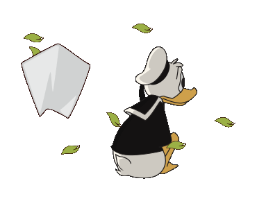
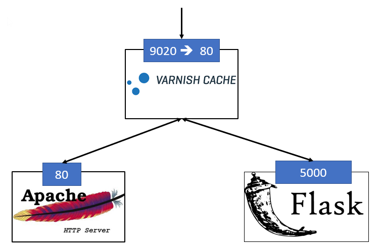
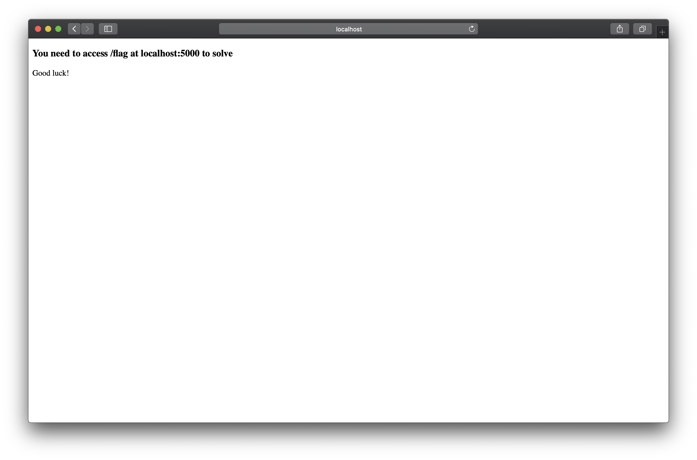

<br>
<br>

Can't get enough? Want to learn some more fancy things? How's about tricking a Varnish Cache? This scenario helps to understand how you could reach a hidden website f.e. an Intranet webserver with internal information. Pretty sneaky right? 

Now to your goal: To get the flag at the internal network `flask.net` you need to open `/flag`. Obviously you can't access the `/flag` from the outer apache `apache.net` network. As a valuable hint you might need to investiage `socket.io` in the requests and watch out for `html` stuff. It really help to use `Burp` or another attack proxy to time your attack and investiage the target. 

To achive this - you need to write some code :)


<p align="center">

</p>


The setup of this challenge is based on three components:
1. Varnis cache to accelerate the routing between the webservices
2. Apache Webserver running at `apache.net` - this mimes a regular public website of a company
3. Flask Webserver running at `flask.net` - the target that we want to access to get valuable internal information




<br>
<br>

<br>
<br>

To build simply run: 

```bash
docker-compose up
```

The varnish server will on the port 9020. To check if everything works visit http://localhost:9020/. After accessing the site, you will see this:


This means everything is fine

By visiting http://localhost:9020/websocket.html, you will see a websocket example.



Since this challenge is hard to tackle:


The WebSocket communication consists of two parts: 
* handshake 
* data transfer

Like always TCP or TLS connection is established first with the backend, next the handshake will be performed over the established connection. In the final step the WebSocket frames will be **transferred through the same TCP or TLS connection**. 

As a real hacker it's time to read how the WebSocket protocol is described in [RFC 6455](https://tools.ietf.org/html/rfc6455).

Let us inspect the handshake part which is performed over the HTTP protocol version 1.1 (as it is described in RFC 6455). The Client sends a GET request (aka **Upgrade request**) to the backend with the set of special HTTP headers. These are typically: `Upgrade`, `Sec-WebSocket-Version` and `Sec-WebSocket-Key`.

Such a request can look like this:

```bash
GET /socket.io/?EIO=3&transport=websocket HTTP/1.1
Host: websocket.example.com
Sec-WebSocket-Version: 13
Origin: http://websocket.example.com
Sec-WebSocket-Key: U2Nyb29nZSBNY0R1Y2s6IEkgTWFkZSBpdCBieSBiZWluZyB0b3VnaGVyIHRoZW4gdGhlIHRvdWdoaWVzLCBhbmQgc21hcnRlciB0aGVuIHRoZSBzbWFydGllcyEgQW5kIEkgbWFkZSBpdCBTUVVBUkUK
Connection: keep-alive, Upgrade
Pragma: no-cache
Cache-Control: no-cache
Upgrade: websocket
```

Now disect the Headers from above a little:
* `Sec-WebSocket-Version` contains WebSocket protocol version (most of the times only version `13` is supported)
* `Sec-WebSocket-Key` contains usually a random nonce that is base64 encoded
* `Upgrade` header contain value `websocket`

Most of the time a Backend should respond with HTTP status code `101` and acknowledge the nonce which was sent by the client. The Backend should compute a value to confirm the request by using the nonce from client and is sent back to the client inside the `Sec-WebSocket-Accept` HTTP Header.

```bash
HTTP/1.1 101 Switching Protocols
Upgrade: websocket
Connection: Upgrade
Sec-WebSocket-Accept: xUFfT1/AIvZnGdK/XSbIr7zQO10=
```

After performing a successfull handshake, the client or backend can transfer data using WebSocket frames. Intressting to know is that there are multipe kinds of frames. Each frame has a field `opcode` which tells more about its type.

**What's important that client must do a so-called client-to-server masking!** Masking is done to mitigate potential attacks on the infrastructure that proxies the WebSocket connections between client and backend. As pointed in RFC 6455, there was a [research](http://www.adambarth.com/papers/2011/huang-chen-barth-rescorla-jackson.pdf) done that showed a proof for cache poisoning attacks against proxies in case client doesn't perform client-to-server masking. This also leads to a possible HTTP smuggling attack.

