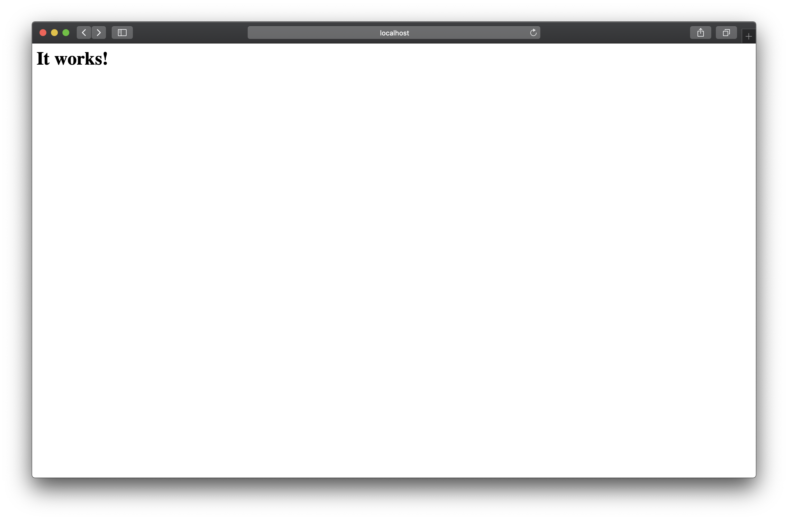

<br>
<br>

Can't get enough? Want to learn some more fancy things? How's about tricking a Varnish Cache? This scenario helps to understand how you could reach a hidden website f.e. an Intranet webserver with internal information. Pretty sneaky right? 

Now to your goal: To get the flag at the internal network `flask.net` you need to open `/flag`. Obviously you can't access the `/flag` from the outer apache `apache.net` network. As a valuable hint you might need to investiage `/socket.io` in the requests. It really help to use `Burp` or another attack proxy to time your attack and investiage the target. 

To achive this - you need to write some code :)


<p align="center">

</p>


The setup of this challenge is based on three components:
1. Varnis cache to accelerate the routing between the webservices
2. Apache Webserver running at `apache.net` - this mimes a regular public website of a company
3. Flask Webserver running at `flask.net` - the target that we want to access to get valuable internal information


<br>
<br>

<br>
<br>

To build simply run: 

```bash
docker-compose up
```

The varnish server will on the port 9020. To check if everything works visit http://localhost:9020/. After accessing the site, you will see this:



This means everything is fine

By visiting http://localhost:9020/websocket.html, you will see a websocket example.


